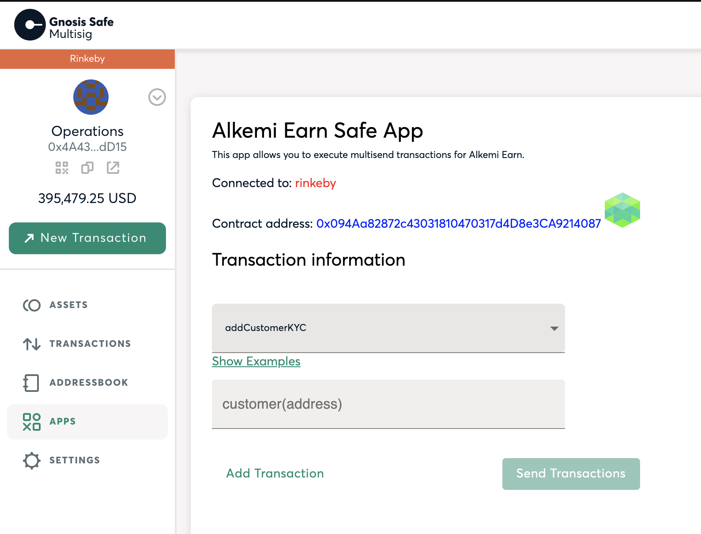
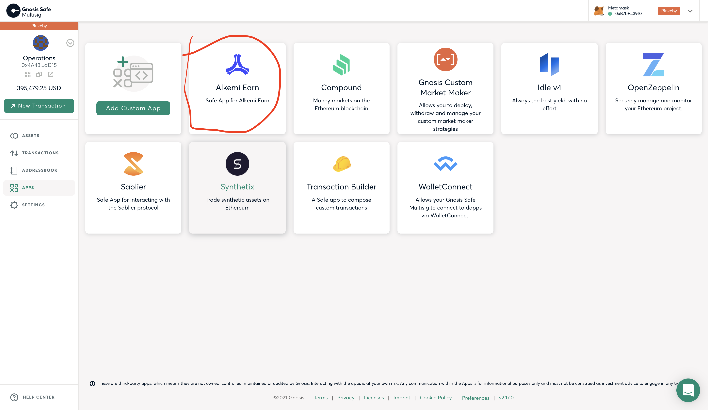

# Alkemi Earn Safe App


 [](https://docs.alkemi.network/earn-ui) [](https://web3js.readthedocs.io/en/v1.3.0/) [](https://twitter.com/AlkemiOfficial)

> Gnosis Safe App for Alkemi Earn



## Getting Started

Install dependencies and start a local dev server.

```
npm i -g yarn
yarn install
cp .env.sample .env
yarn start
```

Then:

-   If HTTPS is used (by default enabled)
    -   Open your Safe app locally (by default via https://localhost:3000/) and accept the SSL error.
-   Go to Safe Multisig web interface
    -   [Mainnet](https://app.gnosis-safe.io)
    -   [Rinkeby](https://rinkeby.gnosis-safe.io/app)
-   Create your test safe
-   Go to Apps -> Manage Apps -> Add Custom App
-   Paste your localhost URL, default is https://localhost:3000/
-   You should see Alkemi Earn Safe App as a new app



-   Develop your app from there

## Features

Gnosis Safe App Starter combines recommendations described in the following repositories:

-   [Safe Apps SDK](https://github.com/gnosis/safe-apps-sdk)
-   [safe-react-components](https://github.com/gnosis/safe-react-components)

You can use the `useSafe` React hook to interact with the Safe Apps SDK

```
const safe = useSafe();
console.log(safe.info);
```

Safe React Components are also integrated and ready to use. [See all components](https://components.gnosis-safe.io/).

## Dependencies

### Included

-   [`@gnosis.pm/safe-react-components`](https://github.com/gnosis/safe-react-components) (UI components themed for the Safe Multisig interface)
-   [`@rmeissner/safe-apps-react-sdk`](https://github.com/rmeissner/safe-sdks-js/tree/master/safe-apps-react-sdk) (React hook for the Safe Apps SDK)

### Recommended

-   [`ethers`](https://github.com/ethers-io/ethers.js) (Library for interacting with Ethereum)
-   [`web3`](https://github.com/ethereum/web3.js/) (Library for interacting with Ethereum)
-   [`@studydefi/money-legos`](https://github.com/studydefi/money-legos) (Library for DeFi interactions)

## Issues

If you come across an issue with this repo, do a search in the [Issues](https://github.com/project-alkemi/alkemi-earn-safe-app/issues) tab of this repo to make sure it hasn't been reported before. Follow these steps to help us prevent duplicate issues and unnecessary notifications going to the many people watching this repo:

-   If the issue you found has been reported and is still open, and the details match your issue, give a "thumbs up" to the relevant posts in the issue thread to signal that you have the same issue. No further action is required on your part.
-   If the issue you found has been reported and is still open, but the issue is missing some details, you can add a comment to the issue thread describing the additional details.
-   If the issue you found has been reported but has been closed, you can comment on the closed issue thread and ask to have the issue reopened because you are still experiencing the issue. Alternatively, you can open a new issue, reference the closed issue by number or link, and state that you are still experiencing the issue. Provide any additional details in your post so we can better understand the issue and how to fix it.

## Author

👤 **Alkemi**

-   Website: [alkemi.network](https://alkemi.network)
-   Twitter: [@AlkemiOfficial](https://twitter.com/AlkemiOfficial)
-   Github: [@project-alkemi](https://github.com/project-alkemi)

## 📝 License

MIT License

Permission is hereby granted, free of charge, to any person obtaining a copy
of this software and associated documentation files (the "Software"), to deal
in the Software without restriction, including without limitation the rights
to use, copy, modify, merge, publish, distribute, sublicense, and/or sell
copies of the Software, and to permit persons to whom the Software is
furnished to do so, subject to the following conditions:

The above copyright notice and this permission notice shall be included in all
copies or substantial portions of the Software.

THE SOFTWARE IS PROVIDED "AS IS", WITHOUT WARRANTY OF ANY KIND, EXPRESS OR
IMPLIED, INCLUDING BUT NOT LIMITED TO THE WARRANTIES OF MERCHANTABILITY,
FITNESS FOR A PARTICULAR PURPOSE AND NONINFRINGEMENT. IN NO EVENT SHALL THE
AUTHORS OR COPYRIGHT HOLDERS BE LIABLE FOR ANY CLAIM, DAMAGES OR OTHER
LIABILITY, WHETHER IN AN ACTION OF CONTRACT, TORT OR OTHERWISE, ARISING FROM,
OUT OF OR IN CONNECTION WITH THE SOFTWARE OR THE USE OR OTHER DEALINGS IN THE
SOFTWARE.
